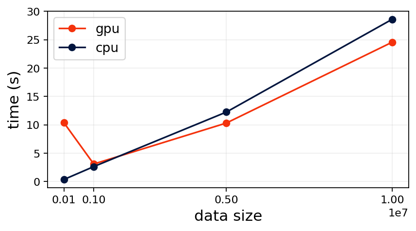

**How useful is using kmeans_pytorch if you have GPU?**

Let's find out !!


```python
# installation
!pip install kmeans-pytorch
```

    Collecting kmeans-pytorch
      Downloading https://files.pythonhosted.org/packages/b5/c9/eb5b82e7e9741e61acf1aff70530a08810aa0c7e2272c534ff7a150fc5bd/kmeans_pytorch-0.3-py3-none-any.whl
    Installing collected packages: kmeans-pytorch
    Successfully installed kmeans-pytorch-0.3
    

## Import Packages


```python
import torch
import numpy as np
import matplotlib.pyplot as plt
from time import time
from kmeans_pytorch import kmeans, kmeans_predict
```

## Set Random Seed (For Reproducibilty)


```python
# set random seed
np.random.seed(123)
```

## Set Number of Dimensions, Number of Clusters


```python
# dimensions, num clusters
dims, num_clusters = 2, 3
```

## Set Data Sizes


```python
# data sizes
data_sizes = [100000, 1000000, 5000000, 10000000]
```

## Compute CPU and GPU Times


```python
gpu_times = []
cpu_times = []

for data_size in data_sizes:
    print(f'\ndata size: {data_size}')

    # data
    x = np.random.randn(data_size, dims) / 6
    x = torch.from_numpy(x)

    # gpu
    start_gpu = time()
    kmeans_gpu = kmeans(X=x, num_clusters=num_clusters, device=torch.device('cuda:0'))
    gpu_time = time() - start_gpu
    gpu_times.append(gpu_time)
    print(f'gpu time: {gpu_time}')
    
    # cpu
    start_cpu = time()
    kmeans_cpu = kmeans(X=x, num_clusters=num_clusters, device=torch.device('cpu'))
    cpu_time = time() - start_cpu
    cpu_times.append(cpu_time)
    print(f'cpu time: {cpu_time}')
```

    
    data size: 100000
    running k-means on cuda:0..
    

    [running kmeans]: 6it [00:00, 13.96it/s, center_shift=0.000058, iteration=6, tol=0.000100]
    [running kmeans]: 2it [00:00, 16.60it/s, center_shift=0.003620, iteration=3, tol=0.000100]

    gpu time: 10.371965885162354
    running k-means on cpu..
    

    [running kmeans]: 7it [00:00, 19.78it/s, center_shift=0.000048, iteration=7, tol=0.000100]
    [running kmeans]: 0it [00:00, ?it/s]

    cpu time: 0.36179161071777344
    
    data size: 1000000
    running k-means on cuda:0..
    

    [running kmeans]: 7it [00:03,  2.31it/s, center_shift=0.000070, iteration=7, tol=0.000100]
    [running kmeans]: 0it [00:00, ?it/s]

    gpu time: 3.0890297889709473
    running k-means on cpu..
    

    [running kmeans]: 6it [00:02,  2.31it/s, center_shift=0.000054, iteration=6, tol=0.000100]
    

    cpu time: 2.6320385932922363
    
    data size: 5000000
    

    [running kmeans]: 0it [00:00, ?it/s]

    running k-means on cuda:0..
    

    [running kmeans]: 5it [00:10,  2.02s/it, center_shift=0.000037, iteration=5, tol=0.000100]
    [running kmeans]: 0it [00:00, ?it/s]

    gpu time: 10.312965869903564
    running k-means on cpu..
    

    
    [running kmeans]: 0it [00:01, ?it/s, center_shift=0.069426, iteration=1, tol=0.000100]
    [running kmeans]: 1it [00:01,  1.98s/it, center_shift=0.069426, iteration=1, tol=0.000100]
    [running kmeans]: 1it [00:03,  1.98s/it, center_shift=0.004168, iteration=2, tol=0.000100]
    [running kmeans]: 2it [00:03,  1.99s/it, center_shift=0.004168, iteration=2, tol=0.000100]
    [running kmeans]: 2it [00:06,  1.99s/it, center_shift=0.001386, iteration=3, tol=0.000100]
    [running kmeans]: 3it [00:06,  2.00s/it, center_shift=0.001386, iteration=3, tol=0.000100]
    [running kmeans]: 3it [00:07,  2.00s/it, center_shift=0.000462, iteration=4, tol=0.000100]
    [running kmeans]: 4it [00:07,  2.00s/it, center_shift=0.000462, iteration=4, tol=0.000100]
    [running kmeans]: 4it [00:10,  2.00s/it, center_shift=0.000153, iteration=5, tol=0.000100]
    [running kmeans]: 5it [00:10,  2.02s/it, center_shift=0.000153, iteration=5, tol=0.000100]
    [running kmeans]: 5it [00:12,  2.02s/it, center_shift=0.000051, iteration=6, tol=0.000100]
    [running kmeans]: 6it [00:12,  2.01s/it, center_shift=0.000051, iteration=6, tol=0.000100]

    cpu time: 12.246060371398926
    
    data size: 10000000
    running k-means on cuda:0..
    

    
    
    [running kmeans]: 0it [00:00, ?it/s]
    
    [running kmeans]: 0it [00:03, ?it/s, center_shift=0.108101, iteration=1, tol=0.000100]
    
    [running kmeans]: 1it [00:03,  3.98s/it, center_shift=0.108101, iteration=1, tol=0.000100]
    
    [running kmeans]: 1it [00:08,  3.98s/it, center_shift=0.007211, iteration=2, tol=0.000100]
    
    [running kmeans]: 2it [00:08,  4.03s/it, center_shift=0.007211, iteration=2, tol=0.000100]
    
    [running kmeans]: 2it [00:12,  4.03s/it, center_shift=0.001613, iteration=3, tol=0.000100]
    
    [running kmeans]: 3it [00:12,  4.04s/it, center_shift=0.001613, iteration=3, tol=0.000100]
    
    [running kmeans]: 3it [00:16,  4.04s/it, center_shift=0.000406, iteration=4, tol=0.000100]
    
    [running kmeans]: 4it [00:16,  4.01s/it, center_shift=0.000406, iteration=4, tol=0.000100]
    
    [running kmeans]: 4it [00:20,  4.01s/it, center_shift=0.000130, iteration=5, tol=0.000100]
    
    [running kmeans]: 5it [00:20,  3.99s/it, center_shift=0.000130, iteration=5, tol=0.000100]
    
    [running kmeans]: 5it [00:24,  3.99s/it, center_shift=0.000044, iteration=6, tol=0.000100]
    
    [running kmeans]: 6it [00:24,  4.00s/it, center_shift=0.000044, iteration=6, tol=0.000100]

    gpu time: 24.558437824249268
    running k-means on cpu..
    

    
    
    
    [running kmeans]: 0it [00:00, ?it/s]
    
    
    [running kmeans]: 0it [00:03, ?it/s, center_shift=0.170225, iteration=1, tol=0.000100]
    
    
    [running kmeans]: 1it [00:03,  3.97s/it, center_shift=0.170225, iteration=1, tol=0.000100]
    
    
    [running kmeans]: 1it [00:08,  3.97s/it, center_shift=0.013261, iteration=2, tol=0.000100]
    
    
    [running kmeans]: 2it [00:08,  4.03s/it, center_shift=0.013261, iteration=2, tol=0.000100]
    
    
    [running kmeans]: 2it [00:12,  4.03s/it, center_shift=0.003844, iteration=3, tol=0.000100]
    
    
    [running kmeans]: 3it [00:12,  4.04s/it, center_shift=0.003844, iteration=3, tol=0.000100]
    
    
    [running kmeans]: 3it [00:16,  4.04s/it, center_shift=0.001250, iteration=4, tol=0.000100]
    
    
    [running kmeans]: 4it [00:16,  4.03s/it, center_shift=0.001250, iteration=4, tol=0.000100]
    
    
    [running kmeans]: 4it [00:20,  4.03s/it, center_shift=0.000416, iteration=5, tol=0.000100]
    
    
    [running kmeans]: 5it [00:20,  4.01s/it, center_shift=0.000416, iteration=5, tol=0.000100]
    
    
    [running kmeans]: 5it [00:24,  4.01s/it, center_shift=0.000139, iteration=6, tol=0.000100]
    
    
    [running kmeans]: 6it [00:24,  4.00s/it, center_shift=0.000139, iteration=6, tol=0.000100]
    
    
    [running kmeans]: 6it [00:28,  4.00s/it, center_shift=0.000047, iteration=7, tol=0.000100]
    
    
    [running kmeans]: 7it [00:28,  4.00s/it, center_shift=0.000047, iteration=7, tol=0.000100]

    cpu time: 28.59460973739624
    

## Plot
Plot the CPU and GPU times


```python
# plot
plt.figure(figsize=(6, 3), dpi=160)
plt.plot(data_sizes, gpu_times, marker='o', label='gpu', color='xkcd:vermillion')
plt.plot(data_sizes, cpu_times, marker='o', label='cpu', color='xkcd:navy')
plt.xticks(data_sizes)
plt.legend(fontsize=12)
plt.grid(alpha=0.2)
plt.xlabel('data size', fontsize=14)
plt.ylabel('time (s)', fontsize=14)
plt.show()
```





## Key Takeaways
1. Using GPU is not always faster than using CPU for kmeans in PyTorch
2. Use GPU if the data size is large


```python

```
